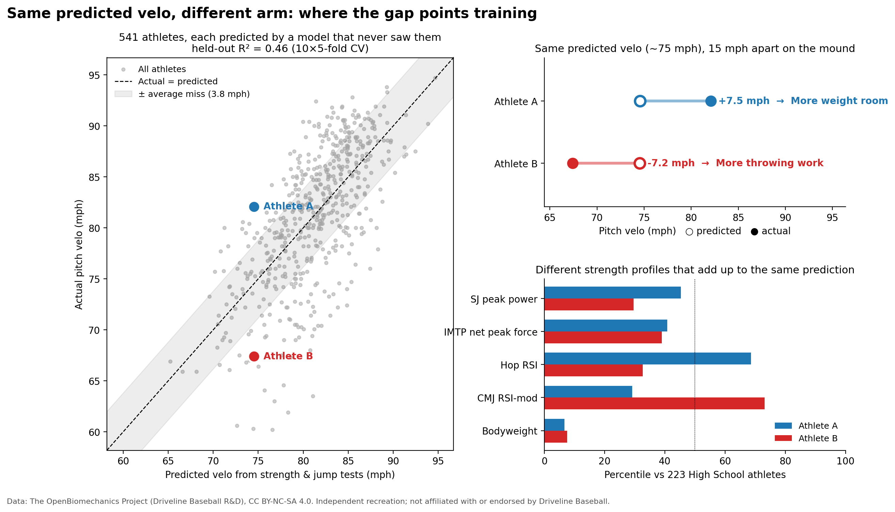
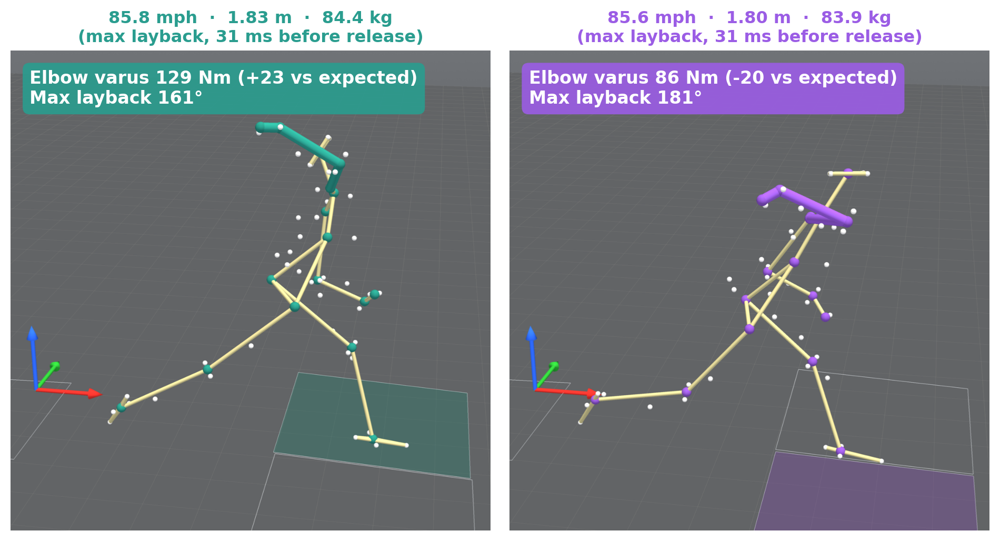
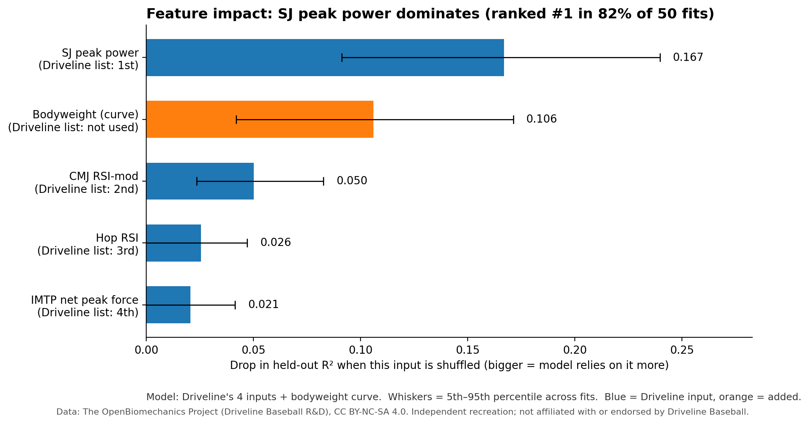
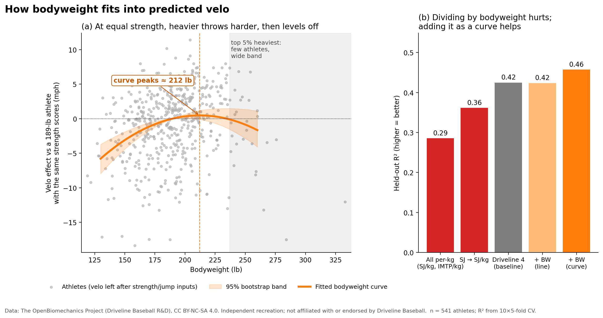

# Predicting Pitch Velocity from Force-Plate Tests: an Independent Recreation

A recreation of the **Predicted Pitch Velocity** model by [Driveline Baseball (2021)](https://drivelinebaseball.com/blogs/blog/predicted-pitch-velocity), rebuilt on the public [OpenBiomechanics Project](https://github.com/drivelineresearch/openbiomechanics) (OBP) High Performance dataset.



*Athletes A and B are high schoolers who both throw ~78 mph. Based on A's force plate/strength tests, the model predicts a 71 mph pitch, while A actually throws 6.9 mph above that. B scores in the 94th–99th percentile on every force test, with a predicted 88 mph pitch, but B throws 10.4 mph below. The pair is purely demonstrative, of how this model can guide weight room vs mechanics training. A who is ≥ 6 mph above what their strength says their mph "should" be, could benefit from more S&C, while B in the top 25% of predictions and ≥ 6 mph below it could benefit with mechanics changes.
([`src/fig_two_athletes.py`](src/fig_two_athletes.py)).*



*What the strength tests can't show: how the delivery loads the arm. These two college right-handers from OBP's
separate pitching-biomechanics dataset (different athletes from A and B) throw the same speed (85.7 mph) and are
matched on size, but the left pitcher's elbow varus moment is 23 Nm higher than expected for their velo and size (129 vs 86 Nm), and they lay back 20° less (161° vs 181°). Each is shown at max layback, with the throwing arm in color. See [Beyond the tests](#beyond-the-tests-elbow-stress-beyond-expected).*

## TL;DR

| | Driveline (2021, published) | My recreation (Driveline's 4 inputs) | + bodyweight curve |
|---|---|---|---|
| Held-out R² | 0.54 | **0.43** (5–95%: 0.32–0.52) | **0.46** (0.34–0.58) |
| Mean absolute error | 2.7 mph | 3.98 mph | 3.82 mph |
| Athletes | not reported | 541 | 541 |

**The velo model (main project)**
- **Squat-jump peak power is the dominant input**, consistent with Driveline's statement that it is the metric most correlated with pitch velocity.
- **Relative (per-kg) strength makes predictions worse.** Held-out R² falls to 0.29 when both power and strength are divided by bodyweight.
- **Adding bodyweight as a curve helps.** It beats the baseline in 96% of cross-validation fits (partial F(2,534) = 17.6, p = 4×10⁻⁸). At equal strength, heavier athletes throw harder up to about 212 lb, then the effect levels off.

**Secondary: elbow stress beyond expected** (OBP's separate biomechanics dataset, 100 pitchers)
- **Pitchers whose elbow load runs above what their velo and size predict lay back *less*, not more:** 164° vs 174° (partial r = −0.46). It's lower through the whole cocking phase, not just at the peak (spm1d), and lower in all 13 tightly matched pairs.
- **They also stride straighter and rotate further by release** (−0.1° vs +4.7° cross-body; 123° vs 116°). Hip-shoulder separation and pelvis-to-torso timing don't differ.

## Background

I loved Driveline's idea: that fitness tests can model the pitching velo an athlete's body "should" produce. The **gap** between predicted and actual velo then points training. Athletes throwing *above* prediction shift toward the weight room; athletes throwing *below* it shift toward throwing and mechanics work. Their published model was a multiple linear regression with a 75/25 train/test split, VIF < 5, and residual checks. The four inputs "weighted the heaviest" were:

| Test | Input | Plain meaning |
|---|---|---|
| Squat Jump (SJ) | Peak power (W) | Push power from a paused squat, no bounce |
| Countermovement Jump (CMJ) | RSI-modified | Jump height ÷ time to take off |
| 10/5 Hop test | RSI (flight ÷ contact time) | Reactive "springiness" |
| Isometric Mid-Thigh Pull (IMTP) | Net peak force (N) | Maximal pulling strength |

The gap also raised a second question for me. It finds athletes who throw below prediction to push toward mechanics work, but mechanics change more than speed: they change how much load the arm has to absorb. Two pitchers can throw the same velo while their elbows carry very different loads. The strength-test data can't see that, but OBP's separate pitching-biomechanics dataset can, with full motion capture for 100 pitchers. So, as a smaller side project, I asked which pitchers load their elbow more than their velo and size predict, and what their deliveries have in common.

## Data

- **Source:** OBP `high_performance/hp_obp.csv`, pinned to commit
  [`44b98da`](https://github.com/drivelineresearch/openbiomechanics/tree/44b98dae05cceb016f080ab39d105c85b8639084/high_performance)
  and downloaded by `src/fetch_data.py`. The data is not stored in this repo.
- **Cohort:** 541 athletes (223 high school, 267 college, 51 pro), tested Jan 2023 – Aug 2024,
  from 1,934 raw test rows.
- **Cleaning** (all in `src/common.py`):
  - Kept rows with all four inputs, pitch velo, and bodyweight.
  - Dropped velo < 60 mph (includes 0-mph placeholders).
  - Dropped one physically implausible RSI-mod value.
  - Kept each athlete's **first test only**, so no athlete appears twice.
- **Pitching biomechanics ("Beyond the tests" only):** OBP `baseball_pitching` summary metrics at the same commit,
  plus joint-position and joint-angle tables (360 Hz) and the raw C3D files (45 markers at 360 Hz) from the `dataset-v1` release, all
  checksum-verified. 100 pitchers, 411 fastballs; 4 pitches with broken event timing (foot plant after release, or
  more than 0.4 s before it) are dropped (→ 407).
  **These are different athletes.** OBP states that the two datasets use different IDs and provides no link between them.
- **Column note:** OBP includes two hop-test RSI columns. This project uses the flight-time/contact-time ratio,
  which is Driveline's definition. The `jump_height/contact_time` column is a different metric with a different scale.

## Method

- **Model:** ordinary least squares multiple linear regression (scikit-learn / statsmodels).
- **Validation:** 10× repeated 5-fold cross-validation (50 fits). Every held-out number in this README is the
  mean across those fits. Since each athlete has one row, no athlete is ever in both the training and test folds.
- **Feature impact:** permutation importance, i.e. the drop in held-out R² when one input is shuffled. The two
  bodyweight terms are shuffled together.
- **Inference:** overall and partial F-tests, checked with HC3 heteroscedasticity-robust errors, Breusch-Pagan,
  Shapiro-Wilk and Cook's distance.
- **Bodyweight curve uncertainty:** 1,000 bootstrap refits resampling athletes.
- **Elbow stress beyond expected:** one row per pitcher (pitches averaged). Peak elbow varus moment is regressed on
  velo, mass and height (OLS, R² = 0.51), and the residual is split into top vs bottom thirds. Groups are compared on
  all 75 other OBP summary metrics with Cohen's d, a 5,000-permutation test (seed 0) and Benjamini-Hochberg FDR.
  Layback is also tested as a partial correlation adjusted for velo, mass and height. The whole layback curve is
  compared with [spm1d](https://spm1d.org), a two-sample t-test corrected over time with random field theory. The
  window is −300 to +90 ms around release; each pitch is linearly interpolated onto one 360 Hz grid aligned to
  release, then averaged per pitcher.
- **3D renders:** made with pyvista (VTK) from the raw C3D markers and OBP's model joint centers at max layback, drawn
  as a stick skeleton through the joint centers, with the throwing arm in color. Joint centers are used as OBP
  provides them (already low-pass filtered by OBP: 4th-order Butterworth, 20 Hz). Each pitcher is shown with their
  pitch closest to their own median elbow load. Built-in check: the raw elbow markers sit within 0.3 mm of the model
  elbow joint center.

## Results

### Feature impact


In the final model, SJ peak power ranks #1 in 82% of fits. Bodyweight is a clear #2. The three remaining
Driveline inputs fall in the same order as Driveline's list, but their ranges overlap, so that ordering is not firm.
In the 4-input model without bodyweight, IMTP carries more weight. That suggests part of its signal was standing in
for body size.

### Bodyweight


| Model | Held-out R² | MAE (mph) |
|---|---|---|
| All per-kg (SJ/kg, IMTP/kg) | 0.29 | 4.44 |
| SJ → SJ/kg | 0.36 | 4.19 |
| Driveline 4 (baseline) | 0.43 | 3.98 |
| + bodyweight (straight line) | 0.42 | 3.96 |
| **+ bodyweight curve (final)** | **0.46** | **3.82** |

Dividing by bodyweight penalizes heavier athletes, who, at the same power output, tend to throw harder. A
straight-line bodyweight term adds nothing. A curve does. The dip above ~212 lb is **not** statistically supported:
past the peak the bootstrap band is wide enough to fit a flat curve, and only 5% of athletes weigh more than 237 lb.

### F-tests
All four Driveline inputs remain significant in the final model (all p < 0.05, including with robust errors).

### Beyond the tests: elbow stress beyond expected
Force-plate tests measure capacity. They don't show how the delivery loads the arm. In OBP's separate pitching
dataset (100 pitchers), I looked for pitchers whose elbow carries more load than their velo and size predict.

- **Metric:** peak elbow varus moment, the load on the inside of the elbow that the UCL resists, minus what velo, mass
  and height predict. The top and bottom thirds give 34 vs 34 pitchers who are matched on velo (84.7 vs 84.2 mph),
  mass (92 vs 91 kg), height (1.86 m) and age (21.3 yr), but differ by 30 Nm in elbow load (128 vs 98 Nm).
- **What differs:** 6 of 75 metrics survive FDR correction (q < 0.05):

| Metric | High stress | Low stress | Cohen's d |
|---|---|---|---|
| Max layback (shoulder external rotation) | 164° | 174° | −1.11 |
| Stride angle (+ = cross-body) | −0.1° | +4.7° | −0.92 |
| Torso rotation at release | 123° | 116° | +0.89 |
| Max elbow extension velocity | 2,574 °/s | 2,372 °/s | +0.96 |
| Shoulder energy absorbed, foot plant to release | 31 J | 16 J | +1.11 |
| Shoulder internal rotation moment\* | 121 Nm | 95 Nm | +1.72 |

\*Computed from the same arm model as the elbow load, so this one is partly circular.

- **The surprise is layback:** less layback, not more, goes with extra elbow load. The partial r is −0.46 after
  adjusting for velo, mass and height. In all 13 tightly matched right-handed high/low pairs, the higher-stress
  pitcher lays back less. It isn't only the peak: an spm1d test on the whole layback curve finds it lower in the
  high-stress group from 144 ms before release through 32 ms after (one significant cluster, p < 10⁻¹³). The two
  pitchers under the headline figure are the pair with the largest gap.
- **No clear difference:** hip-shoulder separation or pelvis-to-torso timing.

Caveats: these are not the athletes in the headline figure. Elbow moment is a model-based load estimate, not an
injury, and OBP has no injury outcomes. The groups are 34 vs 34, mostly college fastballs from one lab. Reasons *why*
less layback goes with more elbow load are hypotheses, not tested here.

Full tables: [`results/01_baseline.md`](results/01_baseline.md),
[`results/02_f_tests.md`](results/02_f_tests.md), [`results/03_bodyweight.md`](results/03_bodyweight.md),
[`results/05_elbow_stress.md`](results/05_elbow_stress.md).

### Why the recreation scores lower than Driveline's published model
Likely reasons, none of which can be confirmed from public information:
- **Different target:** Driveline used motion-capture velo, while OBP's `pitch_speed_mph` is undocumented.
- **Different cohort:** 2023–24 athletes vs. Driveline's pre-2021 sample.
- **Unknown extra inputs:** Driveline listed only the inputs "weighted heaviest."
- **Evaluation method:** Driveline reported a single 75/25 split. Across 50 fits here, R² ranges from 0.32 to 0.52.

## Limitations
- No height, age, limb length or handedness in the data. Bodyweight likely stands in partly for body size.
- Associations only. Nothing here shows that raising a test score *causes* higher velo.
- Residuals are left-skewed: some athletes throw far below prediction, which is exactly the "skill gap" case.
- OBP column definitions are intentionally undocumented, and the OBP README asks users not to infer formulas.
- One dataset, with no external validation.
- The strength-test athletes and the biomechanics pitchers can't be linked, so no single athlete's tests and
  delivery can be compared directly.

## Reproduce

```bash
git clone https://github.com/1raync/predicted-velo-recreation.git
cd predicted-velo-recreation
pip install -r requirements.txt
python run_all.py        # downloads ~310 MB of OBP data, writes results/ and figures/ (~2-3 min)
```

## Attribution & licenses
- **Data:** The OpenBiomechanics Project, Driveline Baseball Research & Development,
  <https://github.com/drivelineresearch/openbiomechanics>, licensed
  [CC BY-NC-SA 4.0](https://creativecommons.org/licenses/by-nc-sa/4.0/). OBP's license also includes a
  **professional-organization exclusion**. Read
  [LICENSE-DATA.md](https://github.com/drivelineresearch/openbiomechanics/blob/main/LICENSE-DATA.md)
  before using the data. Please cite OBP via its
  [CITATION.cff](https://github.com/drivelineresearch/openbiomechanics/blob/main/CITATION.cff).
- **Figures and results** in `figures/` and `results/` are derived from OBP data and are shared under
  CC BY-NC-SA 4.0 (see [`LICENSE-DATA.md`](LICENSE-DATA.md)).
- **Code** in this repo: MIT (see [`LICENSE`](LICENSE)).
- Method inspired by Driveline Baseball's public blog posts. This project is not affiliated with or endorsed by Driveline.

## References
- Driveline Baseball. *Predicted Pitch Velocity* (2021). <https://drivelinebaseball.com/blogs/blog/predicted-pitch-velocity>
- Driveline Baseball. *High Performance Assessment: Strength Testing Using Force Plates* (2020). <https://www.drivelinebaseball.com/2020/11/high-performance-assessment-strength-testing-using-force-plates/>
- Driveline Baseball. *Free Strength Training Program* (2021). <https://drivelinebaseball.com/blogs/blog/free-strength-training-program-baseball>
- The OpenBiomechanics Project. <https://github.com/drivelineresearch/openbiomechanics>
